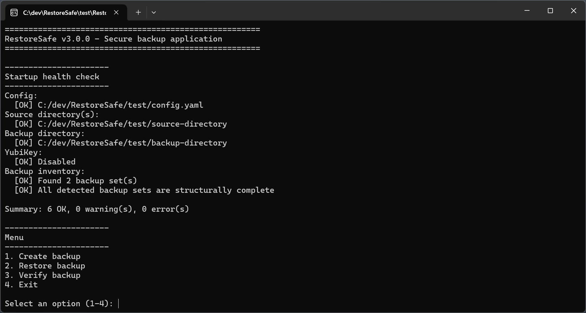

# RestoreSafe

[](https://github.com/phsc84/RestoreSafe/releases)
[](https://github.com/phsc84/RestoreSafe/releases)
[](LICENSE)
[](https://go.dev/dl/)

RestoreSafe is a standalone Windows 64-bit backup tool that backs up your directories into encrypted, split archive files, with password protection and optional YubiKey 2FA. Restore your backups anytime using the same secure password or YubiKey authentication.

## Table of Contents

- [Screenshot](#screenshot)
- [Features](#features)
- [Installation & Configuration](#installation--configuration)
- [Usage](#usage)
- [Naming scheme of created files](#naming-scheme-of-created-files)
- [YubiKey setup](#yubikey-setup)
- [Building from source](#building-from-source)

## Screenshot



## Features

### Core
- Backs up one or more source directories into split, encrypted `.enc` archive files
- Restores selected backup sets to a chosen destination
- Verifies backup integrity (decryption + archive readability) without restoring
- Retention policy: automatically keeps only the newest N backup sets per source directory (configured via `retention_keep` in `config.yaml`)

### Security
- AES-256-GCM encryption (content and metadata/file names)
- Argon2id key derivation
- Password-only, password + YubiKey 2FA, or YubiKey-only authentication modes

### Reliability
- Local staging: when source and target share the same drive/share (e.g. NAS), parts are written to local TEMP first, then moved
- Startup health check: validates directories, temp access, YubiKey CLI, and structural integrity of existing backups at launch
- Streaming pipeline: no intermediate temp files, low CPU/RAM footprint

### Usability
- Portable, standalone `.exe` - no runtime dependencies
- Interactive menu; custom config path via `-config` flag
- Per-run log files; configurable log level
- Backup split size configurable; supports multiple source directories with automatic alias disambiguation

## Installation & Configuration

### Requirements

- Windows 64-bit

### First time usage

1. [Download](https://github.com/phsc84/RestoreSafe/releases) the latest version of RestoreSafe and extract it to any directory on your computer.
2. Rename `config-SAMPLE.yaml` to `config.yaml`.

   By default, RestoreSafe loads config.yaml from the same directory as the executable. When managing multiple backup configurations, it may be useful to load `config.yaml` from a separate directory. In that case create a `.bat` file to launch RestoreSafe with the desired config (always use an absolute path):

   ```bat
   @echo off
   "C:\Tools\RestoreSafe\RestoreSafe.exe" -config="D:\Configs\home-backup.yaml"
   pause
   ```
3. In `config.yaml` edit at least parameters `source_directories` and `backup_directory`.

   For any other parameters you may keep the default values or adjust them according to your needs.

   #### Authentication mode comparison

   | Setting | Password prompt | Second factor | Description |
   |---|---|---|---|
   | `authentication_mode: 1` | Yes | None | Standard password-only backup |
   | `authentication_mode: 2` | Yes | YubiKey | Password + YubiKey two-factor |
   | `authentication_mode: 3` | No | YubiKey | Password-less, key-in-hand authentication |

   The automatically generated `.challenge` file(s) in `authentication_mode: 2` and `authentication_mode: 3` must be stored together with the corresponding `.enc` file(s). The `.challenge` files do not contain secret keys, but are required for restore when YubiKey mode is enabled.
   
   In `authentication_mode: 3` physical possession of the YubiKey is the sole authentication factor. Keep your YubiKey safe - anyone with the YubiKey and the `.challenge` file can restore the backup.

### Updating

[Download](https://github.com/phsc84/RestoreSafe/releases) the latest version of RestoreSafe.exe and replace the existing version on your computer. See [CHANGELOG.md](CHANGELOG.md) for a summary of changes between versions.

If updating to a new major version (v1.x.x → v2.x.x), please also download `config-SAMPLE.yaml`, rename it to `config.yaml` and set the parameters according to your previous `config.yaml`.

This is not needed when updating to a new minor version (v1.0.x → v1.1.x) or a new bugfix version (v1.0.1 → v1.0.2).

## Usage

### Create a backup
Double-click RestoreSafe.exe, choose **Backup** from the menu, confirm the preflight summary, and enter your password (and touch the YubiKey if enabled).

### Restore a backup
Double-click RestoreSafe.exe, choose **Restore** from the menu, select the backup set(s) and destination directory, then enter your password (and touch the YubiKey if enabled).

The restore destination must not already exist — RestoreSafe creates it during restore and will abort if the path is already present.

### Verify a backup
Double-click RestoreSafe.exe, choose **Verify** from the menu, and select the backup set(s) to check. RestoreSafe confirms all parts are present, decryptable, and form a readable archive - without writing any files to disk.

## Naming scheme of created files

### Quick reference

| Name part | Meaning |
|---|---|
| DirectoryName | Name of the source directory |
| YYYY-MM-DD | Backup date |
| ID | Short backup run code (6 characters, A-Z and 0-9) |
| 001 / 002 / ... | File part number when the backup is split |

### Backup files

`[DirectoryName]_YYYY-MM-DD_ID-001.enc`

Samples:

```text
[Documents]_2026-01-15_ABC123-001.enc
[Documents]_2026-01-15_ABC123-002.enc
[Documents]_2026-01-15_ABC123-003.enc
[Pictures]_2026-01-15_ABC123-001.enc
```

### Challenge files (.challenge)

only created if YubiKey is enabled → `authentication_mode: 2` and `authentication_mode: 3`

`[DirectoryName]_YYYY-MM-DD_ID.challenge`

Samples:

```text
[Documents]_2026-01-15_ABC123.challenge
[Pictures]_2026-01-15_ABC123.challenge
```

### Log files

`YYYY-MM-DD_ID.log`

Sample:

```text
2026-01-15_ABC123.log
```

### Special cases

If several configured source directories have the same directory name (for example all end with `Documents`), RestoreSafe keeps the directory name and adds an extra alias derived from the remaining path and the drive letter. Only this added alias part is adjusted. The source directory name itself stays unchanged.
In the added alias part, every character outside `a-zA-Z0-9` is encoded as UTF-8 hex bytes in the form `~XX~`:

Examples **without** special characters in that added alias part:

```text
C:\RootA\Documents → [Documents__RootA-C]_2026-01-15_ABC123-001.enc
D:\RootB\Documents → [Documents__RootB-D]_2026-01-15_ABC123-001.enc
```

Examples **with** special characters in that added alias part:

```text
C:\Root A\Documents → [Documents__Root~20~A-C]_2026-01-15_ABC123-001.enc
C:\Root-A\Documents → [Documents__Root~2D~A-C]_2026-01-15_ABC123-001.enc
C:\Root_A\Documents → [Documents__Root~5F~A-C]_2026-01-15_ABC123-001.enc
C:\Root.A\Documents → [Documents__Root~2E~A-C]_2026-01-15_ABC123-001.enc
C:\Root~A\Documents → [Documents__Root~7E~A-C]_2026-01-15_ABC123-001.enc
```

**Result:** Backup file names remain deterministic and distinct across special characters.

## YubiKey setup

Compatibility note: RestoreSafe supports only YubiKey v5 hardware.

1. Install [Yubico Authenticator](https://www.yubico.com/products/yubico-authenticator/) and open it.
2. Go to **Slots**, select a slot (slot 2 recommended - slot 1 holds the factory Yubico OTP by default), and choose **Challenge-response**. Generate a random secret key, enable **Require touch**, and save.
3. Set `authentication_mode` in `config.yaml`: `2` for password + YubiKey (2FA), or `3` for password-less YubiKey-only mode.
4. Insert and touch the YubiKey when prompted during backup or restore.

## Building from source

### Prerequisites

- [Go](https://go.dev/dl/) 1.26 or later
- [goversioninfo](https://github.com/josephspurrier/goversioninfo): `go install github.com/josephspurrier/goversioninfo/cmd/goversioninfo@latest`
- `ykman.exe` placed in `assets\`: install [YubiKey Manager](https://www.yubico.com/support/download/yubikey-manager/) and copy `ykman.exe` from its installation directory to `assets\`

### Build

```bat
build.bat
```

This compiles `RestoreSafe.exe`, creates `RestoreSafe-<version>.zip`, and extracts it to the `test\` directory for local testing.
