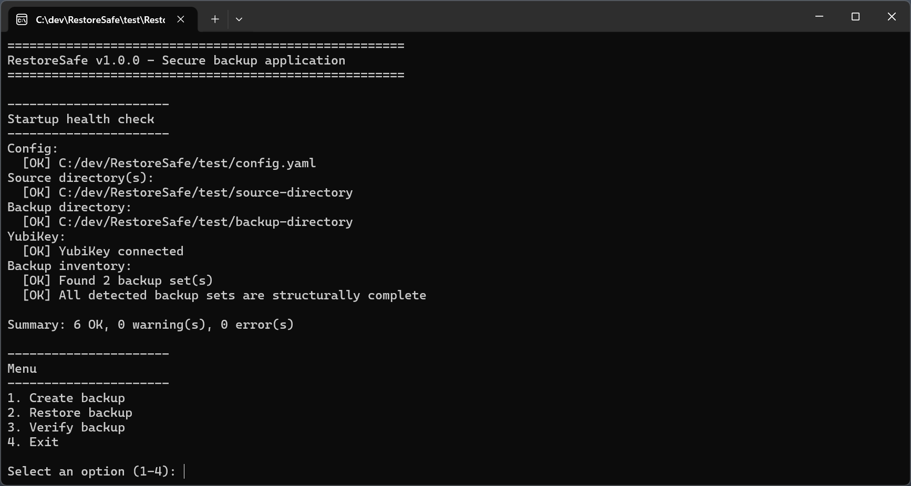

# RestoreSafe

[](https://github.com/phsc84/RestoreSafe/releases)
[](https://github.com/phsc84/RestoreSafe/releases)
[](LICENSE)
[](https://go.dev/dl/)

RestoreSafe is a standalone Windows 64-bit backup tool that backs up your directories into encrypted, split archive files, with password protection and optional YubiKey 2FA. Restore your backups anytime using the same secure password or YubiKey authentication.

## Table of Contents

- [Screenshot](#screenshot)
- [Features](#features)
- [Installation & Configuration](#installation--configuration)
- [Usage](#usage)
- [Naming scheme of created files](#naming-scheme-of-created-files)
- [Known limitations](#known-limitations)
- [YubiKey setup](#yubikey-setup)
- [Development setup](#development-setup)

## Screenshot



## Features

### Core
- Backs up one or more source directories into split, encrypted `.enc` archive files
- Restores selected backup sets to a chosen destination
- Verifies backup integrity (decryption + archive readability) without restoring
- Retention policy: automatically keeps only the newest N backup sets per source directory (configured via `retention_keep` in `config.yaml`)

### Security
- AES-256-GCM encryption (content and metadata/file names)
- Argon2id key derivation
- Password-only, password + YubiKey 2FA, or YubiKey-only authentication modes

### Reliability
- Startup health check: validates directories, YubiKey, and structural integrity of existing backups at launch
- Streaming pipeline: no intermediate temp files, low CPU/RAM footprint
- Local staging: when source and backup directory share the same drive (e.g. NAS), parts are written to local TEMP first, then moved
- Optional post-backup verification: when `verify_after_backup: true`, each backup re-reads and decrypts its freshly written parts to confirm they restore, catching an unrestorable backup at backup time instead of at restore time

### Usability
- Portable, standalone `.exe` - no runtime dependencies
- Interactive menu; custom config path via `-config` flag
- Backup split size configurable; supports multiple source directories with automatic alias disambiguation
- Per-run log files; configurable log level

## Installation & Configuration

### Requirements

- Windows 64-bit

### First time usage

1. [Download](https://github.com/phsc84/RestoreSafe/releases) the latest version of RestoreSafe and extract it to any directory on your computer.
2. Rename `config-SAMPLE.yaml` to `config.yaml`.

   By default, RestoreSafe loads config.yaml from the same directory as the executable. When managing multiple backup configurations, it may be useful to load `config.yaml` from a separate directory. In that case create a `.bat` file to launch RestoreSafe with the desired config (always use an absolute path):

   ```bat
   @echo off
   "C:\Tools\RestoreSafe\RestoreSafe.exe" -config="D:\Configs\home-backup.yaml"
   pause
   ```
3. In `config.yaml` edit at least parameters `source_directories` and `backup_directory`.

   For any other parameters you may keep the default values or adjust them according to your needs.
4. Authentication mode comparison

   | Setting | Password prompt | Second factor (2FA) | Description |
   |---|---|---|---|
   | `authentication_mode: 1` | Yes | None | Standard password-only backup |
   | `authentication_mode: 2` | Yes | YubiKey | Password + YubiKey |
   | `authentication_mode: 3` | No | YubiKey | Password-less, key-in-hand authentication |

   The automatically generated `.challenge` file(s) in `authentication_mode: 2` and `authentication_mode: 3` must be stored together with the corresponding `.enc` file(s). The `.challenge` files do not contain secret keys, but are required for restore when YubiKey mode is enabled.
   
   In `authentication_mode: 3` the YubiKey FIDO2 credential is the sole RestoreSafe authentication factor. Keep your YubiKey and FIDO2 PIN safe - anyone who can complete the YubiKey prompt with the matching `.challenge` file can restore the backup.

### Updating

[Download](https://github.com/phsc84/RestoreSafe/releases) the latest version of RestoreSafe.exe and replace the existing version on your computer. See [CHANGELOG.md](CHANGELOG.md) for a summary of changes between versions.

If updating to a new major version (v1.x.x → v2.x.x), please also download `config-SAMPLE.yaml`, rename it to `config.yaml` and set the parameters according to your previous `config.yaml`.

This is not needed when updating to a new minor version (v1.0.x → v1.1.x) or a new bugfix version (v1.0.1 → v1.0.2).

## Usage

### Create a backup
Double-click RestoreSafe.exe, choose **Backup** from the menu, confirm the preflight summary, and enter your password (or touch the YubiKey when it blinks, if YubiKey authentication is configured).

### Restore a backup
Double-click RestoreSafe.exe, choose **Restore** from the menu, select the backup set(s) and destination directory, then enter your password (or touch the YubiKey when it blinks, if YubiKey authentication is configured).

The restore destination must not already exist - RestoreSafe creates it during restore and will abort if the path is already present.

### Verify a backup
Double-click RestoreSafe.exe, choose **Verify** from the menu, and select the backup set(s) to check. RestoreSafe confirms all parts are present, decryptable, and form a readable archive - without writing any files to disk.

## Naming scheme of created files

### Quick reference

| Name part | Meaning |
|---|---|
| DirectoryName | Name of the source directory |
| YYYY-MM-DD | Backup date |
| ID | Short backup run code (6 characters, A-Z and 0-9) |
| 001 / 002 / ... | File part number when the backup is split |

### Backup files

`[DirectoryName]_YYYY-MM-DD_ID-001.enc`

Samples:

```text
[Documents]_2026-01-15_ABC123-001.enc
[Documents]_2026-01-15_ABC123-002.enc
[Documents]_2026-01-15_ABC123-003.enc
[Pictures]_2026-01-15_ABC123-001.enc
```

### Challenge files (.challenge)

only created if YubiKey is enabled → `authentication_mode: 2` and `authentication_mode: 3`

`[DirectoryName]_YYYY-MM-DD_ID.challenge`

Samples:

```text
[Documents]_2026-01-15_ABC123.challenge
[Pictures]_2026-01-15_ABC123.challenge
```

### Log files

`YYYY-MM-DD_ID.log`

Sample:

```text
2026-01-15_ABC123.log
```

### Special cases

If several configured source directories have the same directory name (for example all end with `Documents`), RestoreSafe keeps the directory name and adds an extra alias derived from the remaining path and the drive letter. Only this added alias part is adjusted. The source directory name itself stays unchanged.
In the added alias part, every character outside `a-zA-Z0-9` is encoded as UTF-8 hex bytes in the form `~XX~`:

Examples **without** special characters in that added alias part:

```text
C:\RootA\Documents → [Documents__from__C_RootA]_2026-01-15_ABC123-001.enc
D:\RootB\Documents → [Documents__from__D_RootB]_2026-01-15_ABC123-001.enc
```

Examples **with** special characters in that added alias part:

```text
C:\Root A\Documents → [Documents__from__C_Root~20~A]_2026-01-15_ABC123-001.enc
C:\Root-A\Documents → [Documents__from__C_Root~2D~A]_2026-01-15_ABC123-001.enc
C:\Root_A\Documents → [Documents__from__C_Root~5F~A]_2026-01-15_ABC123-001.enc
C:\Root.A\Documents → [Documents__from__C_Root~2E~A]_2026-01-15_ABC123-001.enc
C:\Root~A\Documents → [Documents__from__C_Root~7E~A]_2026-01-15_ABC123-001.enc
```

**Result:** Backup file names remain deterministic and distinct across special characters.

## Known limitations

A restored backup is not a byte-for-byte mirror of the source. The following file metadata is intentionally **not** preserved:

- **Symbolic links are dropped.** Symlinks (and other non-regular entries such as junctions, devices, and named pipes) in the source are skipped and are not recreated on restore. This is a deliberate security choice: recreating symlinks during extraction is a common path-traversal attack vector, so RestoreSafe never writes them. Only directories and regular files are restored.
- **File permissions are normalized.** Restored files are written with fixed `0o640` permissions and directories with `0o750`, regardless of the source mode. Original permission bits, ownership, and Windows ACLs are not carried over.

Restore preserves directory structure, file names, and file contents. If you require symlink or permission fidelity, capture that metadata with a separate tool before backing up.

## YubiKey setup

RestoreSafe uses the Windows WebAuthn API for YubiKey authentication. In plain English: Windows shows the security prompts, the YubiKey performs the protected operation, and RestoreSafe receives only the result needed to encrypt or decrypt the backup. RestoreSafe never sees your FIDO2 PIN, and the YubiKey does not give its private secret to Windows or RestoreSafe.

### Requirements

- YubiKey 5 series
- A FIDO2 PIN set on the YubiKey
- Windows 11 version 22H2 or later

Other FIDO2 security keys may support similar technology, but RestoreSafe currently detects and supports Yubico YubiKeys only. Use a YubiKey 5-series device for YubiKey authentication.

### Before first use

1. Install [Yubico Authenticator](https://www.yubico.com/products/yubico-authenticator/) and open it with the YubiKey inserted.
2. Go to **Passkeys** -> **PIN** and set a FIDO2 PIN if you have not done so already. Windows may prompt for administrator rights when you open this section - this is expected. The PIN is used to authorize the Windows Security prompts that appear during backup, restore, and verify.
3. Set `authentication_mode` in `config.yaml`:
   - `2` - password + YubiKey (2FA)
   - `3` - YubiKey-only (no password)

### What RestoreSafe stores

When YubiKey authentication is enabled, RestoreSafe creates a `.challenge` file next to the encrypted backup parts. This file stores only two things:

- A credential ID, which tells the YubiKey which backup credential to use later.
- A random salt, which is safe helper data used to reproduce the same YubiKey response during restore or verify.

The `.challenge` file does not contain your password, your FIDO2 PIN, or a secret key. Still, keep it with the matching `.enc` files: without it, RestoreSafe cannot ask the YubiKey the same question again during restore.

### What happens behind the prompts

On backup, RestoreSafe asks Windows to create a new YubiKey credential for that backup run. Windows shows the prompt, you enter the FIDO2 PIN and touch the YubiKey, and the YubiKey creates the credential internally. RestoreSafe receives only the credential ID.

RestoreSafe then asks Windows to use that new credential with a random salt. Windows shows a second prompt, you authorize it again, and the YubiKey calculates a 32-byte response. RestoreSafe combines that response with your backup password, or uses it by itself in YubiKey-only mode, to derive the encryption key.

The important part: the YubiKey secret stays inside the YubiKey. Windows is the messenger, not the owner of the secret.

### What to expect during backup

Backup triggers two Windows Security prompts in sequence:

1. **Register security key** - Windows asks the YubiKey to create the backup credential. Enter your FIDO2 PIN and touch the YubiKey when it blinks.
2. **Use your security key** - Windows asks the YubiKey to calculate the response used for encryption. Enter your PIN again if Windows asks, and touch the YubiKey a second time.

This double prompt is expected during backup. Restore and verify need only the second kind of prompt because the backup credential already exists.

### What to expect during restore and verify

One Windows Security prompt appears:

- **Use your security key** - enter your FIDO2 PIN and touch the YubiKey.

The same YubiKey that was used during backup must be present. If the YubiKey is lost, the backup cannot be restored.

## Development setup

### Prerequisites

- [Go](https://go.dev/dl/) 1.26 or later
- [goversioninfo](https://github.com/josephspurrier/goversioninfo): `go install github.com/josephspurrier/goversioninfo/cmd/goversioninfo@latest`

### Build

```bat
build.bat
```

This compiles `RestoreSafe.exe`, creates `RestoreSafe-<version>.zip`, and extracts it to the `test\` directory for local testing.

### YubiKey diagnostic tool

`cmd/yubidiag` is a developer utility that enumerates YubiKey HID devices, reports firmware version and registry entries, checks Windows WebAuthn API availability, and can optionally run a live FIDO2 hmac-secret test with Windows Security prompts. Use it to investigate YubiKey detection and authentication issues during development and testing.

It is not part of the release. To build it:

```bat
go build -o yubidiag.exe ./cmd/yubidiag/
```

To run it:

```bat
yubidiag.exe
```
