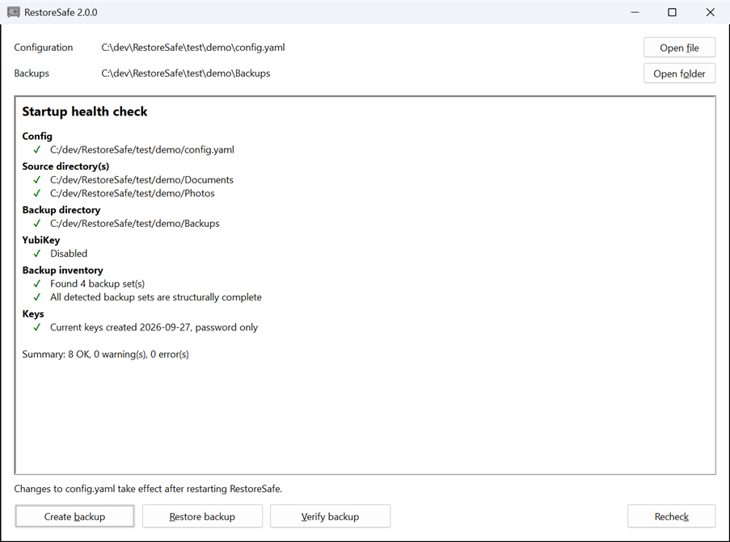
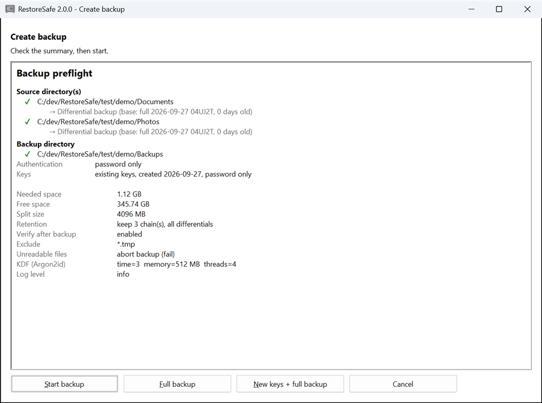
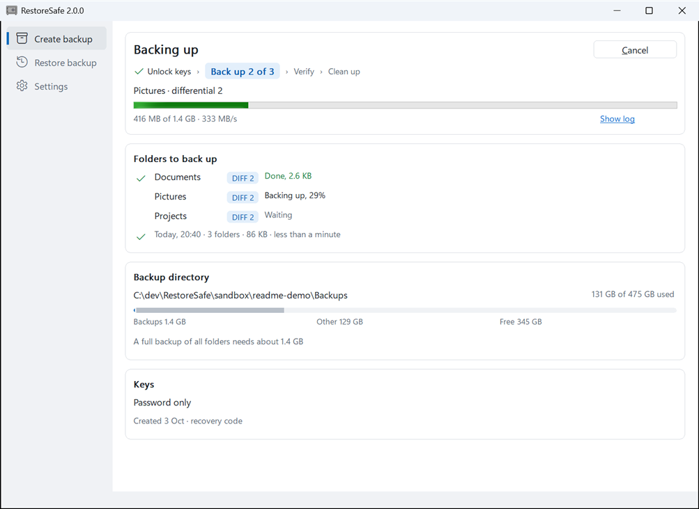
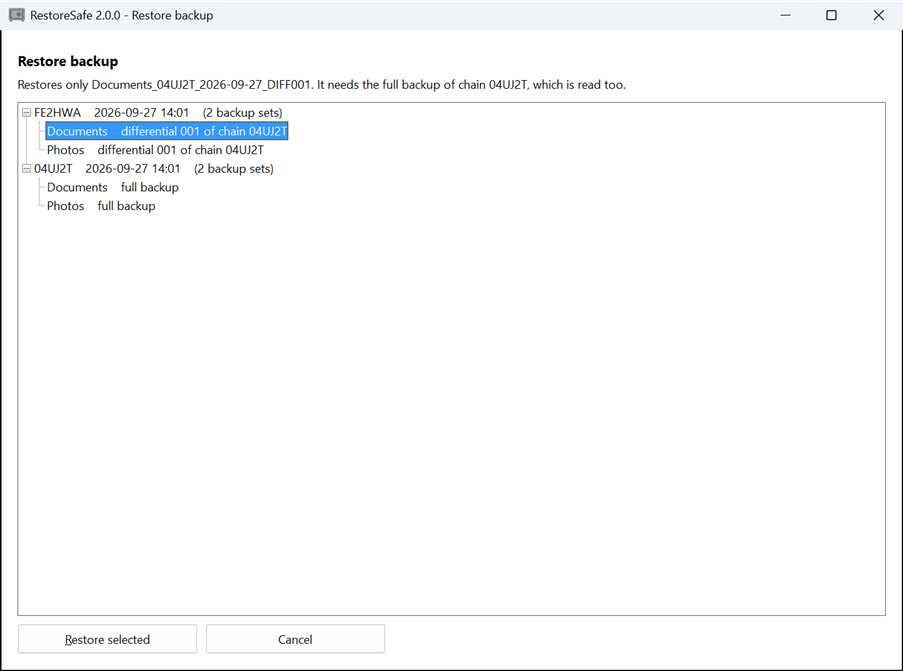

# RestoreSafe

[](https://github.com/phsc84/RestoreSafe/releases)
[](https://github.com/phsc84/RestoreSafe/releases)
[](LICENSE)
[](https://go.dev/dl/)

RestoreSafe is a standalone Windows 64-bit backup tool that backs up your directories into encrypted, split archive files, with password protection and optional YubiKey 2FA. It creates full and differential backups automatically, checks every restored file against its checksum, and needs nothing but `RestoreSafe.exe` to back up, verify, and restore.

## Table of Contents

- [Screenshots](#screenshots)
- [Features](#features)
- [Installation & Configuration](#installation--configuration)
- [Updating](#updating)
- [Usage](#usage)
- [Full and differential backups](#full-and-differential-backups)
- [How your backups are locked](#how-your-backups-are-locked)
- [Naming scheme of created files](#naming-scheme-of-created-files)
- [Known limitations](#known-limitations)
- [YubiKey setup](#yubikey-setup)
- [Development setup](#development-setup)

## Screenshots

The start screen runs a health check of the configuration, the directories, the YubiKey, and the existing backups:



Before a backup starts, the preflight shows what RestoreSafe will do, including whether each directory gets a full or a differential backup:



While it runs, RestoreSafe shows the progress and the log; Cancel stops it and removes the unfinished backup set:



To restore or verify, choose a whole backup run or a single backup set; for a differential, RestoreSafe reads its full backup too:




## Features

### Core
- Backs up one or more source directories into split, encrypted `.enc` archive files
- Full and differential backups: RestoreSafe decides automatically and shows the decision before the backup starts; a differential stores only files that are new or changed since the last full backup
- Restores or verifies any backup, full or differential, and checks every file against its SHA-256 checksum
- Restores file contents, directory structure, timestamps, and the read-only, hidden, and system attributes
- Retention policy: keeps the newest N backup chains (a full backup plus its differentials) and optionally only the newest differentials per chain
- Exclude patterns for files and directories you don't want to back up

### Security
- AES-256-GCM encryption (content and metadata/file names)
- Argon2id key derivation
- Password-only, password + YubiKey 2FA, or YubiKey-only authentication modes
- Optional spare YubiKey and recovery code, so losing one YubiKey or forgetting the password does not have to mean losing your backups

### Reliability
- Every backup contains an encrypted manifest: the list of all files with their checksums; restore and verify check each file against it
- A backup appears under its final file names only when it is complete; an interrupted backup never looks like a valid backup
- Startup health check: validates directories, YubiKey, keys, and the structural integrity of existing backups at launch
- Streaming pipeline: low CPU/RAM footprint
- Optional post-backup verification (`verify_after_backup: true`): each new backup is re-read and checked right after it is written

### Usability
- Portable, standalone `.exe` - no runtime dependencies
- Windows application: preflight summary before every operation, progress with a live log, Cancel at any time, and a result screen
- Operable by keyboard (access keys, Enter, Esc) and readable by screen readers
- Custom config path via `-config` argument
- One password entry and at most one YubiKey touch per backup run
- Backup split size configurable; supports multiple source directories with automatic alias disambiguation
- Per-run log files; configurable log level

## Installation & Configuration

### Requirements

- Windows 64-bit

### First time usage

1. [Download](https://github.com/phsc84/RestoreSafe/releases) the latest version of RestoreSafe and extract it to any directory on your computer.
2. Rename `config-SAMPLE.yaml` to `config.yaml`.

   By default, RestoreSafe loads config.yaml from the same directory as the executable. When managing multiple backup configurations, it may be useful to load `config.yaml` from a separate directory. In that case create a shortcut to `RestoreSafe.exe` and add the configuration to its **Target** (always use an absolute path):

   ```text
   "C:\Tools\RestoreSafe\RestoreSafe.exe" -config="D:\Configs\home-backup.yaml"
   ```

   The start screen shows which configuration is loaded. RestoreSafe reads `config.yaml` at start; after changing it, restart RestoreSafe.
3. In `config.yaml` edit at least parameters `source_directories` and `backup_directory`.

   For any other parameters you may keep the default values or adjust them according to your needs. Every parameter is explained in `config-SAMPLE.yaml`.
4. Choose the authentication mode:

   | Setting | Password prompt | Second factor (2FA) | Description |
   |---|---|---|---|
   | `authentication_mode: 1` | Yes | None | Standard password-only backup |
   | `authentication_mode: 2` | Yes | YubiKey | Password + YubiKey |
   | `authentication_mode: 3` | No | YubiKey | Password-less, key-in-hand authentication |

   In `authentication_mode: 3` the YubiKey is the sole RestoreSafe authentication factor. Keep your YubiKey and FIDO2 PIN safe - anyone who can complete the YubiKey prompt can restore the backup.

   Consider `yubikey_spare: true` and `recovery_code: true`; see [How your backups are locked](#how-your-backups-are-locked).

### Main configuration options

| Option | Default | Purpose |
|---|---|---|
| `retention_keep` | `3` | Number of backup chains kept per source directory (0 = keep all) |
| `differential.enabled` | `true` | Create differential backups when a usable full backup exists |
| `differential.full_backup_interval_days` | `30` | Create a new full backup when the last one is this many days old |
| `differential.max_size_percent` | `50` | Create a new full backup when the last differential reached this percentage of the full backup |
| `differential.retention_keep_differentials` | `0` | Differentials kept per chain (0 = keep all) |
| `exclude` | none | Files and directories to leave out (e.g. `*.tmp`, `node_modules`, `/Cache`) |
| `on_unreadable_file` | `fail` | `fail` aborts when a file cannot be read (e.g. locked); `skip` continues and lists the file as a warning |
| `yubikey_spare` | `false` | Register a second YubiKey when new keys are created (modes 2 and 3) |
| `recovery_code` | `false` | Create a recovery code when new keys are created |
| `password_min_length` | `12` | Minimum password length for new keys (at least 8) |
| `verify_after_backup` | `false` | Re-read and check each backup right after writing it |
| `reminder_days` | `7` | Remind on the start screen when the newest backup is older than this many days (0 = no reminder) |

## Updating

[Download](https://github.com/phsc84/RestoreSafe/releases) the latest version of RestoreSafe.exe and replace the existing version on your computer. See [CHANGELOG.md](CHANGELOG.md) for a summary of changes between versions.

If updating to a new major version (v1.x.x → v2.x.x), please also download `config-SAMPLE.yaml`, rename it to `config.yaml` and set the parameters according to your previous `config.yaml`.

This is not needed when updating to a new minor version (v1.0.x → v1.1.x) or a new bugfix version (v1.0.1 → v1.0.2).

### Updating from RestoreSafe 1.x to 2.0

RestoreSafe 2.0 uses a new backup format. **2.0 cannot restore backups created by 1.x**, and 1.x cannot restore 2.0 backups. Your first 2.0 backup starts fresh: it creates new keys and a full backup of every source directory.

- Keep a copy of RestoreSafe 1.0.2 as long as you keep 1.x backups; you need it to restore them.
- 2.0 never modifies or deletes 1.x backup files (`[Name]_DATE_ID-001.enc`, `.challenge`) or their log files, even in the same backup directory. The startup health check reports them as a reminder.
- Delete the 1.x backups yourself once your 2.0 backups are in place and verified.

## Usage

Double-click RestoreSafe.exe. The start screen shows the configuration, the backup directory, and the startup health check. **Create backup**, **Restore backup**, and **Verify backup** are available when the health check finds nothing that blocks them; otherwise the line below the check says why. Fix the problem, then click **Recheck**.

### Create a backup
Click **Create backup**. The preflight summary shows, for every source directory, whether it gets a full or a differential backup and why (see [Screenshots](#screenshots)). For a differential, the needed space is an estimate of the files changed since the full backup; the summary also shows the size if everything were stored again.

Then choose:

- **Start backup** - start the backup as planned
- **Full backup** - full backup for every directory instead (offered when a differential is planned)
- **New keys + full backup** - create new keys and full backups (to change your password, replace a lost YubiKey, or get a new recovery code; see [How your backups are locked](#how-your-backups-are-locked))
- **Cancel**

Then enter your password and/or confirm the Windows Security prompt of your YubiKey. On your first backup, RestoreSafe creates your keys first (see [What you will see](#what-you-will-see)).

While the backup runs, the window shows the progress and the log. **Cancel** stops it: backup sets completed so far are kept, the one being written is removed, and old backups are not cleaned up. Closing the window during a backup asks first and then does the same.

### Restore a backup
Click **Restore backup** and choose what to restore: a backup run (all its backup sets) or a single backup set. Then choose the destination folder (**Browse...**, or restore into the backup directory itself), check the preflight, click **Start restore**, and enter your password and/or confirm your YubiKey.

Every backup is a restore point. Restoring a differential needs the full backup of the same chain (same ID in the file name); RestoreSafe finds it automatically and shows it in the preflight. Files deleted before the differential was created are not restored.

RestoreSafe creates one folder per backup set in the destination, named like the backed-up folder; these folders must not exist yet (the preflight checks it). If a file does not match its checksum, the restore stops and reports that it is incomplete.

### Verify a backup
Click **Verify backup**, choose a backup run or a single backup set, and click **Start verification**. RestoreSafe decrypts everything and checks every file against its checksum - without writing any files to disk. Verifying a differential checks the complete restore point, including the unchanged files in its full backup.

### Excluding files and unreadable files
Use `exclude` in `config.yaml` to leave out files and directories (case-insensitive):

| Pattern | Matches |
|---|---|
| `*.tmp` | Every file or directory named `*.tmp`, at any depth |
| `node_modules` | Every `node_modules` directory with everything inside |
| `/Cache` or `Projects/*/build` | A path from the source directory root (patterns containing `/`) |
| `logs/` | Directories named `logs` only (trailing `/`) |

A file that cannot be read (for example a mail archive locked by an open mail program) aborts the backup by default (`on_unreadable_file: fail`). With `on_unreadable_file: skip`, RestoreSafe backs up everything else, lists the file as a warning, and keeps your older backups of that directory until a backup without skipped files succeeds. In a differential, a changed file that cannot be read keeps its older version from the full backup. Files deleted while the backup runs are simply not included.

## Full and differential backups

- A **full backup** contains every file of a source directory.
- A **differential backup** contains only the files that are new or changed since the last full backup, plus the complete list of all files. It needs its full backup to be restored - and only that one: every differential is independent of the other differentials.
- A **chain** is one full backup plus the differentials based on it. All files of a chain share the same ID in their names.

RestoreSafe creates a differential when all of these hold, otherwise a full backup:

- a complete full backup of the directory exists and uses your current keys;
- `differential.enabled` is `true`;
- the full backup is younger than `differential.full_backup_interval_days`;
- the last differential is smaller than `differential.max_size_percent` of the full backup (each differential contains all changes since the full backup, so differentials grow over time);
- the chain has fewer than 999 differentials.

A file counts as changed when its size, last modification time, or NTFS change time differs from the full backup. Unchanged files are not read at all, which makes differentials fast.

**Rule of thumb for your backup files: all files with the same ID belong together. A `DIFF` file is useless without the `FULL` files of the same ID.** Retention always deletes a chain as a whole, so it never removes a full backup that a kept differential needs.

## How your backups are locked

### In short

- Your backups are encrypted with a **master key** that RestoreSafe creates at random.
- The master key is stored inside every backup, but only in **locked boxes**. Each box opens with one of your unlock methods: your password, your YubiKey, your spare YubiKey, or your recovery code.
- To restore, you only need to open **one** box. Any of your unlock methods works.

### The picture

```text
Every backup file contains:

  Box 1: master key, locked with your password + YubiKey
  Box 2: master key, locked with your password + spare YubiKey    (optional)
  Box 3: master key, locked with your recovery code               (optional)

Open any one box  ->  master key  ->  your files
```

The boxes are not secret. Someone who steals your backup files also has the boxes, but they still need one of your unlock methods to open one. Without it, the backup is useless to them.

### Your unlock methods

| `authentication_mode` | You unlock with | Optional extras |
|---|---|---|
| `1` | Password | Recovery code |
| `2` | Password + YubiKey | Spare YubiKey, recovery code |
| `3` | YubiKey | Spare YubiKey, recovery code |

Turn the extras on in `config.yaml` with `yubikey_spare: true` and `recovery_code: true`.

### What you will see

**Your first backup (key setup).** RestoreSafe creates your keys:

1. You choose a password (at least `password_min_length` characters, 12 by default) and enter it twice.
2. You register your YubiKey (two Windows Security prompts).
3. With `yubikey_spare: true`: RestoreSafe asks you to swap in your spare YubiKey and register it too (two more prompts). Accidentally inserting the first YubiKey again is detected and refused.
4. With `recovery_code: true`: RestoreSafe shows your recovery code once, in a window that does not allow copying it. Write it down on paper and type it back to confirm.
5. Then every source directory gets a full backup.

**Every backup after that.** Enter your password once and/or touch your YubiKey once. RestoreSafe reuses your keys automatically, for differential **and** new full backups, so your spare YubiKey can stay in its safe place.

**Restore and verify.** Enter your password and/or touch whichever of your YubiKeys you have. If your keys have a recovery code, RestoreSafe asks whether to unlock with your password/YubiKey or with the recovery code.

### When RestoreSafe creates new keys

New keys mean: a new master key, new boxes, and a new full backup of every source directory. This happens when:

- you run your first backup, or the backup directory contains no RestoreSafe 2.0 backup anymore (for example because you deleted all backups);
- you change `authentication_mode`, `yubikey_spare`, or `recovery_code` in `config.yaml`;
- you click **New keys + full backup** in the backup summary, to change your password, replace a lost YubiKey, or get a new recovery code.

The backup summary always tells you in advance when new keys will be created and why.

**Important:** new keys come with new unlock methods. Your old password, old YubiKey registrations, and old recovery code do **not** open backups made with the new keys. They still open your older backups, until retention deletes them.

### What to keep where

| Item | Keep it | Never |
|---|---|---|
| Password | In your head or a password manager | In a file next to your backups |
| YubiKey | With you | - |
| Spare YubiKey | At a different, safe place (home safe, trusted person) | In the same bag as your main YubiKey |
| Recovery code | On paper, in a safe place | Next to your backups, or unencrypted on your computer |

The recovery code opens your backups **on its own**, even in password + YubiKey mode. Treat it like the key to a safe.

### What if ...

| Situation | What to do |
|---|---|
| I lost my YubiKey. | Restore with your spare YubiKey or your recovery code. Then click **New keys + full backup** at your next backup to create new keys with a new YubiKey, so you have a spare again. Without spare and recovery code, backups locked with that YubiKey cannot be restored by anyone. |
| I forgot my password. | Restore with your recovery code; it works alone, no password or YubiKey needed. Then click **New keys + full backup** at your next backup to set a new password. Without a recovery code, the backups cannot be restored by anyone. |
| I want to change my password. | Click **New keys + full backup** at the next backup. Your older backups keep opening with the old password. |
| Someone stole my backup drive. | Without your unlock methods, they cannot read anything. If you think your password or recovery code was exposed too, click **New keys + full backup** at your next backup and delete the old backups once the new ones are in place. |
| I deleted all backups. | The next backup creates new keys, like the first time. |

## Naming scheme of created files

### Quick reference

| Name part | Meaning |
|---|---|
| DirectoryName | Name of the source directory |
| ID | Chain ID: the ID of the chain's full backup (6 characters, A-Z and 0-9) |
| YYYY-MM-DD | Date of this backup |
| FULL / DIFFnnn | Full backup, or differential number nnn of the chain |
| 001 / 002 / ... | File part number when the backup is split |

### Backup files

```text
[DirectoryName]_ID_YYYY-MM-DD_FULL-001.enc
[DirectoryName]_ID_YYYY-MM-DD_DIFFnnn-001.enc
```

Samples:

```text
[Documents]_ABC123_2026-09-01_FULL-001.enc       full backup, part 1
[Documents]_ABC123_2026-09-01_FULL-002.enc       full backup, part 2
[Documents]_ABC123_2026-09-12_DIFF001-001.enc    differential 1 of chain ABC123
[Documents]_ABC123_2026-09-26_DIFF002-001.enc    differential 2 of chain ABC123
[Documents]_DEF456_2026-10-01_FULL-001.enc       next chain
[Pictures]_DEF456_2026-10-01_FULL-001.enc
```

The ID comes before the date, so sorting by name (the Windows Explorer default) keeps all files of a chain together. Differential numbers are never reused, even after retention deleted older differentials.

While a backup is being written, its parts carry the extra extension `.tmp`. Leftovers of an interrupted backup are removed at the start of the next backup.

### Log files

`YYYY-MM-DD_ID.log` - one log file per backup run, named after the run's ID (for a full backup, this is its chain ID).

Sample:

```text
2026-10-01_DEF456.log
```

### Special cases

If several configured source directories have the same directory name (for example all end with `Documents`), RestoreSafe keeps the directory name and adds an extra alias derived from the remaining path and the drive letter. Only this added alias part is adjusted. The source directory name itself stays unchanged.
In the added alias part, every character outside `a-zA-Z0-9` is encoded as UTF-8 hex bytes in the form `~XX~`:

Examples **without** special characters in that added alias part:

```text
C:\RootA\Documents → [Documents__from__C_RootA]_ABC123_2026-01-15_FULL-001.enc
D:\RootB\Documents → [Documents__from__D_RootB]_ABC123_2026-01-15_FULL-001.enc
```

Examples **with** special characters in that added alias part:

```text
C:\Root A\Documents → [Documents__from__C_Root~20~A]_ABC123_2026-01-15_FULL-001.enc
C:\Root-A\Documents → [Documents__from__C_Root~2D~A]_ABC123_2026-01-15_FULL-001.enc
C:\Root_A\Documents → [Documents__from__C_Root~5F~A]_ABC123_2026-01-15_FULL-001.enc
C:\Root.A\Documents → [Documents__from__C_Root~2E~A]_ABC123_2026-01-15_FULL-001.enc
C:\Root~A\Documents → [Documents__from__C_Root~7E~A]_ABC123_2026-01-15_FULL-001.enc
```

**Result:** Backup file names remain deterministic and distinct across special characters.

## Known limitations

Restore reproduces directory structure, file names, file contents, creation and modification times, and the read-only, hidden, and system attributes. The following is intentionally **not** preserved:

- **Symbolic links are dropped.** Symlinks (and other non-regular entries such as junctions, devices, and named pipes) in the source are skipped and are not recreated on restore. This is a deliberate security choice: recreating symlinks during extraction is a common path-traversal attack vector, so RestoreSafe never writes them. Only directories and regular files are restored.
- **Permissions are not carried over.** Original permission bits, ownership, and Windows ACLs are not restored; restored files get the default permissions of the destination.
- **Other metadata is not restored:** last-access times, alternate data streams, and EFS encryption or NTFS compression flags.
- **Changed files are copied whole.** A differential stores every changed file completely, even if only a small part of it changed (e.g. a large mail archive or virtual disk).

If you require symlink or permission fidelity, capture that metadata with a separate tool before backing up.

## YubiKey setup

RestoreSafe uses the Windows WebAuthn API for YubiKey authentication. In plain English: Windows shows the security prompts, the YubiKey performs the protected operation, and RestoreSafe receives only the result needed to unlock your backups. RestoreSafe never sees your FIDO2 PIN, and the YubiKey does not give its private secret to Windows or RestoreSafe.

### Requirements

- YubiKey 5 series
- A FIDO2 PIN set on the YubiKey
- Windows 11 version 22H2 or later

Other FIDO2 security keys may support similar technology, but RestoreSafe currently detects and supports Yubico YubiKeys only. Use a YubiKey 5-series device for YubiKey authentication.

### Before first use

1. Install [Yubico Authenticator](https://www.yubico.com/products/yubico-authenticator/) and open it with the YubiKey inserted.
2. Go to **Passkeys** -> **PIN** and set a FIDO2 PIN if you have not done so already (also on your spare YubiKey). Windows may prompt for administrator rights when you open this section - this is expected. The PIN is used to authorize the Windows Security prompts that appear during backup, restore, and verify.
3. Set `authentication_mode` in `config.yaml`:
   - `2` - password + YubiKey (2FA)
   - `3` - YubiKey-only (no password)

### What RestoreSafe stores

For each registered YubiKey, the header of every backup file contains:

- A credential ID, which tells the YubiKey which RestoreSafe credential to use.
- A random salt, which is safe helper data used to reproduce the same YubiKey response.

Neither is secret: they do not contain your password, your FIDO2 PIN, or a key. There are no separate `.challenge` files anymore; everything RestoreSafe needs is inside the `.enc` files.

### What happens behind the prompts

When new keys are created, RestoreSafe asks Windows to create a new YubiKey credential. Windows shows the prompt, you enter the FIDO2 PIN and touch the YubiKey, and the YubiKey creates the credential internally. RestoreSafe receives only the credential ID. RestoreSafe then asks Windows to use that credential with a random salt; the YubiKey calculates a 32-byte response, which RestoreSafe combines with your password (or uses alone in YubiKey-only mode) to lock your box of the master key.

The important part: the YubiKey secret stays inside the YubiKey. Windows is the messenger, not the owner of the secret.

### What to expect

- **Key setup (first backup, or new keys):** two Windows Security prompts per YubiKey - **Register security key** (enter PIN, touch) and **Use your security key** (enter PIN if asked, touch).
- **Every other backup, restore, and verify:** one **Use your security key** prompt. With a spare YubiKey registered, either YubiKey works; connect the one you have.

If all registered YubiKeys are lost and you have no recovery code, backups locked with them cannot be restored by anyone.

## Development setup

### Prerequisites

- [Go](https://go.dev/dl/) 1.27 or later
- [goversioninfo](https://github.com/josephspurrier/goversioninfo): `go install github.com/josephspurrier/goversioninfo/cmd/goversioninfo@latest`

### Build

```bat
build.bat
```

This compiles `RestoreSafe.exe` (a Windows application with the icon, manifest, and version information from `build\windows\`) and creates `RestoreSafe-<version>.zip` in `dist\`. The executable is then moved to `sandbox\` for manual testing.

### Project layout

| Folder | Content |
|---|---|
| `cmd/restoresafe` | Entry point of `RestoreSafe.exe` |
| `cmd/yubidiag` | YubiKey diagnostic tool (see below) |
| `internal/gui` | The window application; `internal/gui/win32` wraps the Windows API it uses |
| `internal/workflow` | Backup, restore, verify, and the startup health check, plus what they share (unlocking, restore points); `workflow/interact` is the contract between the workflows and the GUI |
| `internal/format` | The backup format: TAR archive, container, manifest, set writer, inventory, and file names |
| `internal/security` | Encryption and key derivation (`cryptox`), recovery codes, YubiKey through Windows WebAuthn |
| `internal/config`, `logging`, `fsx`, `buildinfo` | Configuration, log files, file system helpers, version |
| `build/windows` | Icon, application manifest, and version information embedded by `build.bat` |
| `docs` | Specifications and the GUI test checklist |
| `scripts/gui-test` | PowerShell UI automation for the manual GUI checklist |

Imports point downward only (`gui` → `workflow` → `format` → `security`, ...); `go test ./internal/architecture` checks this.

The design of the 2.0 backup format (container, manifest, keys, full and differential backups) is described in [docs/SPEC-restoresafe-2.0.md](docs/SPEC-restoresafe-2.0.md), the window application in [docs/SPEC-restoresafe-gui.md](docs/SPEC-restoresafe-gui.md). The manual GUI test checklist is [docs/GUI-TEST-CHECKLIST.md](docs/GUI-TEST-CHECKLIST.md).

### YubiKey diagnostic tool

`cmd/yubidiag` is a developer utility that enumerates YubiKey HID devices, reports firmware version and registry entries, checks Windows WebAuthn API availability, and can optionally run a live FIDO2 hmac-secret test with Windows Security prompts. Use it to investigate YubiKey detection and authentication issues during development and testing. Set `RESTORESAFE_FIDO2_DEBUG=1` to print WebAuthn details in yubidiag (RestoreSafe itself has no console for them).

It is not part of the release. To build it:

```bat
go build -o yubidiag.exe ./cmd/yubidiag/
```

To run it:

```bat
yubidiag.exe
```
